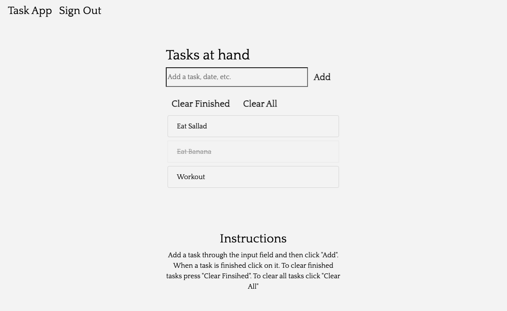
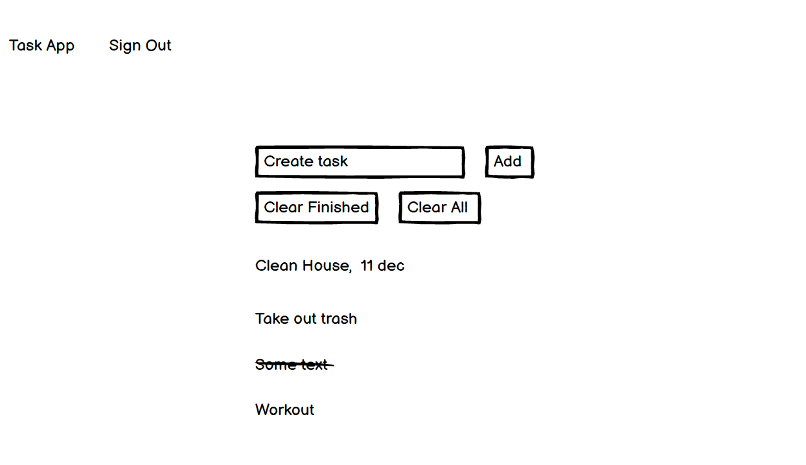
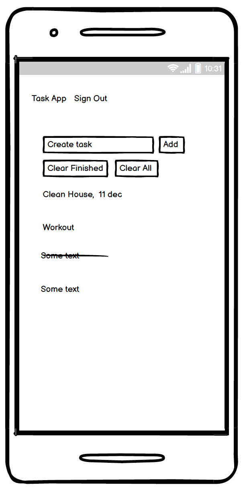

# Introduction

Task App is an app that gives users the possibility to create their own task list. The app enables users to add tasks, mark tasks as finsihed, remove finished tasks and clear all list items.  

[Link to site](task-app007.herokuapp.com)

 ***  

 ## Index – Table of Contents   

* [Wireframes](#Wireframes)  

* [UX](#User-Experience)  

* [Features](#Features)  

* [Technologies](#Technologies)  

* [Testing](#Testing)  

* [Deployment](#Deployment)    

* [Acknowledgements](#Acknowledgements)  

***  

# Wireframes

Computer: 

Phone

# UX

## Goal

The goal is to create an app that enables users to create and continuesly adapt their own task list.

## User stories

As a user I want:

* To be able to use the app on all devices.
* The app to be responsive on all devices.
* To create an account.
* To have clear instructions for how to use the app.
* To have a user specific task list.
* To be able to add tasks to the list.
* To be able to mark tasks as finished.
* To be able to remove finished tasks from the list.
* To be able to remove all tasks from the list.

# Features

* Users can create an account.
* App works on all tested devices.
* App is responive.
* Instructions for how the app works.
* Users has their own list.
* Users can add tasks.
* Users can mark tasks as finished.
* Users can remove finished tasks from the list.
* Users can remove all tasks from the list.

## Future Features

* Enable users to have mulitple lists.
* Enable users to get notifications abouts task deadlines.
* Enable users to share lists with other users.

# Technologys

## Languages

* HTML
* CSS 
* JavaScript
* Python

## Libraries

* Bootstrap 
* Django 
* Google Fonts

## Tools:

* Heroku - for deployment.
* Github - hosts the repository.
* Cloudinary - storage of static files. 
* Allauth - Enables the creation and hosting of users.
* Google Chrome DevTools - for testing and debugging.
* W3 html validator - test html code.
* W3 css validator - test css code.
* PEP8 - test Python code.

# Testing

It's possible to create a user, otherwise a user is provided below:
User: testuser1 Pass: passowl1

The testing can be found [here](test.md).

# Deployment 

## Create Project

* The project respository was create using Code Institutes Gitpod Full [Template](https://github.com/Code-Institute-Org/gitpod-full-template)

## Insalling Modules

Terminal:

pip3 install:
* django gunicorn
* dj_database_url psycopg2
* dj3-cloudinary-storage

After a requirements file was created.
* pip3 freeze --local > requirements.txt

## Cerating Project and App

Create Project
* django-admin startproject project-name
python3 manage.py starapp app-name

settings.py:

Add the created app to the installed apps sections.

After this the changes in the repository can be migrated in the terminal:

python3 manage.py migrate

Then one can check if everything was done correctly through running the server.

python3 manage.py runserver

## Heroku

After one is logged in to Heroku.
* Click on "New" in the right corner and the on "Create new app".
* Choose a app name.
* Select the region closest to where you are.

Under the settings tab:
* Click reveal Config Vars.
* DATABASE_URL, CLOUDINARY_URL, DISABLE_COLLECTSTATIS and SECRET_KEY was added.
 - These variables is part of env.py and are loaded in settings.py.

Under the deploy tab.
* Click on deploy method choose Github and then connect the relevant repository.
* In the automatic deploys section click deploy.

# Acknowledgements

## Tutorials

The bootstrap lessons and the "I Think Thefore I blog" lessons in the course material provided excellent help. A tutorial on a todo app on youtube also was of great help [Tutorial.](https://www.youtube.com/watch?v=phHM6glUURw&t=9s)

## Valuable information
* [Stack Overflow](https://stackoverflow.com/)
* [W3Schools](https://www.w3schools.com)
* Code Institutes learning material.

I want to thank:
* My mentor Tim Nelson for providing excellent guidance.
* Code Insitutes patient tutors.
