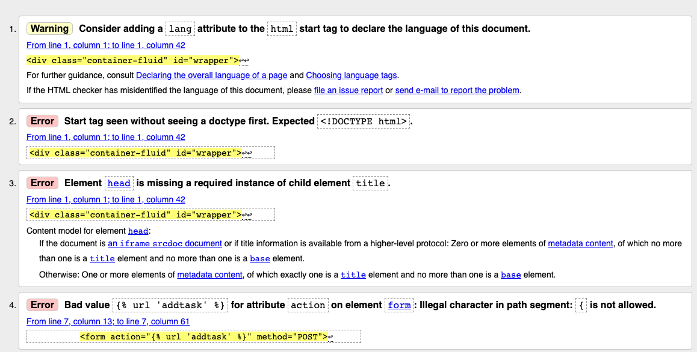
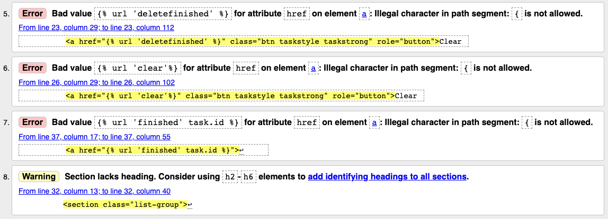
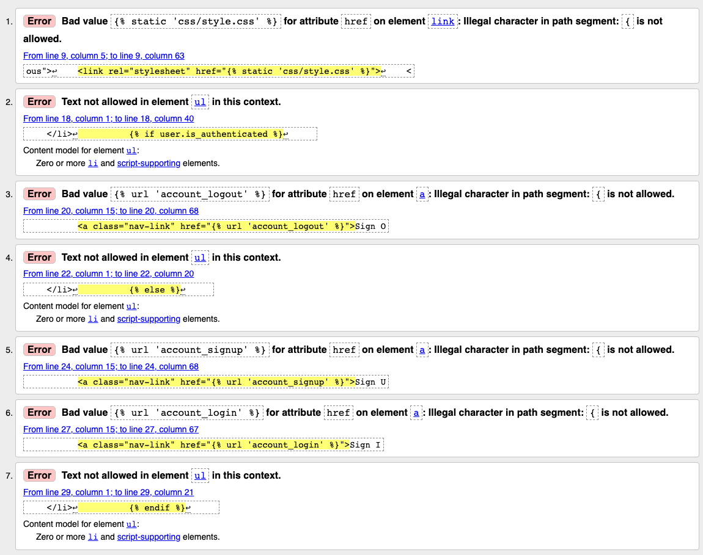

# HTML

## index.html

Since basic.html and index.html are seperated the errors concerning the general layout of a html page are not considered a concern. The errors surrounding the implementation of Django in the HTML are not considered a concern since they mimic the code along project during the module.

Since the author could not find another way of implementing the a-tag in the list the ul and list items were changed to a section with divs. Unfortunately this results in less semantic code, a comment has been added in the html to explain the code.

## basic.html

All errors surrounding the implementation of Django in the HTML are not considered a concern since they mimic the code along project during the module.

# CSS
[W3C Validator](https://jigsaw.w3.org/css-validator/#validate_by_input) was used to check the code, no errors were found.

# PEP8

All django code went through a [PEP8 online test](http://pep8online.com/). All issues concerned unnecessary spacing in empty files, to long lines of code and faulty spacing between functions. All were fixed. Non PEP8 compliant code which was automaticly generated in the settings.py when setting up the project and allauth template files was for the most part ignored except for a few to long lines of code.

# Manual Testing

* Signing up a new user - Without issues.
* Sign in - Without issues.
* Sign out - Without issus.
* Navbar changes depending if user is logged in or not - Without issues.
* Add task input field - Without issues.
* Add task button - Without issues.
* Mark task a finsihed - Without issues.
* Clear finished, button - Without issues.
* Clear all, button - Without issues.

# Device Testing

Phone:

* Samsung A52 - Without issues.
* Iphone 7 - Without issues.

Laptop:

* Mac Book Pro, Chrome - Without issues.
* Mac Book Pro, Firefox - Without issues.
* Mac Book Pro, Brave - Without issues.

Tablet: 

* Ipad A2270, Chrome - Without issues.
